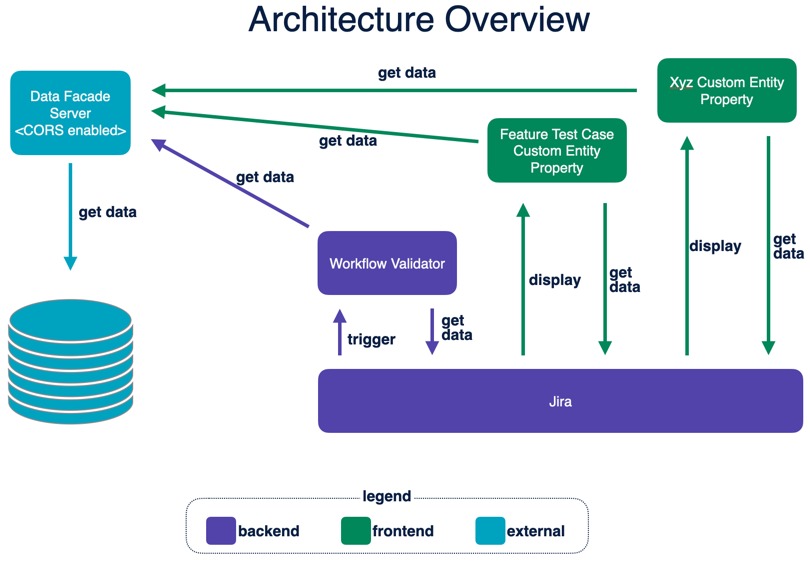

# Forge Workflow Validator Demo

This project contains a Forge app written in Javascript that validates a Jira workflow. 

To get started with Forge, visit [this guide](https://developer.atlassian.com/platform/forge/getting-started/).

## Scenario

A team uses the Capabilities (CAP) project to manage the workflow relating to the delivery of features. Each capability/feature must have at least one related self assessment work items in the Self Assessment (SA) project. 

An external database, mocked by invocations to https://dfds-mock.glitch.me/getCapabilityWorkItem/${capabilityIssueKey}, returns data that needs to be validated against to determine whether the transition is allowed. This data must also be displayed in custom fields.

The app must prevent CAP transitions from "In Progress" to "Resolved" if the current user is not authorized or if there are linked test cases that have not passed.

## Architecture

## Configuration and assumptions

* Capabilities project key: CAP
* Self Assessments project key: SA
* The CAP statuses are `Incomplete`, `In Progress` and `Resolved`.
* The SA statuses are `Pass`, `Fail`, `Blocked`, `Deferred`, `To Be Reviewed`, `Ready To Run`, `Dependent` and `Incomplete`.
* The allowed users that can resolve feature issues is hard coded in [authorizationUtil.ts](https://github.com/dugaldmorrow/forge-workflow-validator/blob/main/src/authorizationUtil.ts#L29), but this could conceivably retrieve users from an external source.

### Notes
- Use the `forge deploy` command when you want to persist code changes.
- Use the `forge install` command when you want to install the app on a new site.
- Once the app is installed on a site, the site picks up the new app changes you deploy without needing to rerun the install command.

## Support

See [Get help](https://developer.atlassian.com/platform/forge/get-help/) for how to get help and provide feedback.
